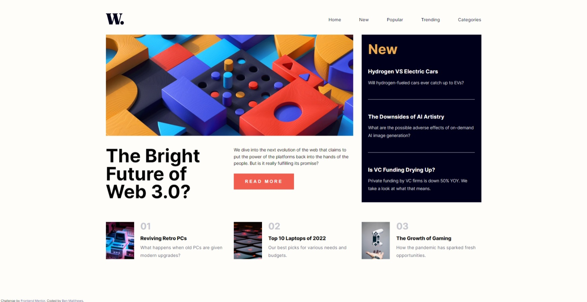
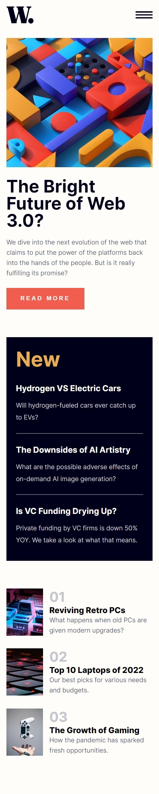
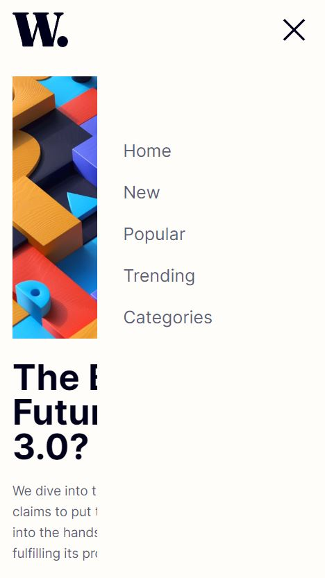

# Frontend Mentor - News homepage solution

This is a solution to the [News homepage challenge on Frontend Mentor](https://www.frontendmentor.io/challenges/news-homepage-H6SWTa1MFl). Frontend Mentor challenges help you improve your coding skills by building realistic projects. 

## Table of contents

- [Overview](#overview)
  - [The challenge](#the-challenge)
  - [Screenshot](#screenshot)
  - [Links](#links)
- [My process](#my-process)
  - [Built with](#built-with)
  - [What I learned](#what-i-learned)
  - [Continued development](#continued-development)
  - [Useful resources](#useful-resources)
- [Author](#author)

## Overview

### The challenge

Users should be able to:

- View the optimal layout for the interface depending on their device's screen size
- See hover and focus states for all interactive elements on the page
- **Bonus**: Toggle the mobile menu (requires some JavaScript)

### Screenshot

### Links

- Solution URL: [GitHub](https://github.com/blue-crona/frontendmentor-news-homepage)
- Live Site URL: [GitHub Pages](https://blue-crona.github.io/frontendmentor-news-homepage/)

## My process

### Built with

- Mobile-first workflow
- Semantic HTML5 markup
- CSS custom properties
- Flexbox
- CSS Grid
- CSS animations
- JavaScript

### What I learned

I learned more about CSS animations and discovered the Picture HTML 5 element.
This was the first time I developed something using a mobile-first workflow and plan to use the workflow in future projects.

### Continued development

Continue learning about CSS animations and practicing with CSS grid.

### Useful resources

- [Picture HTML 5 element](https://developer.mozilla.org/en-US/docs/Web/HTML/Element/picture)
- [CSS transform](https://developer.mozilla.org/en-US/docs/Web/CSS/transform#:~:text=The%20transform%20CSS%20property%20lets,the%20CSS%20visual%20formatting%20model.)
- [CSS transitions](https://developer.mozilla.org/en-US/docs/Web/CSS/transform#:~:text=The%20transform%20CSS%20property%20lets,the%20CSS%20visual%20formatting%20model.)

## Author

- Frontend Mentor - [@blue-crona](https://www.frontendmentor.io/profile/blue-crona)